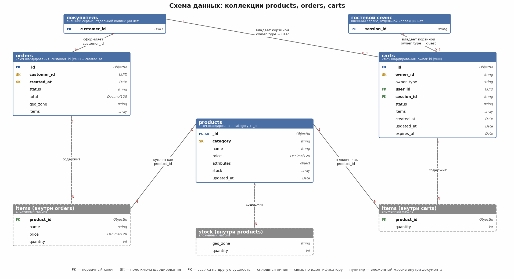

# Архитектурный документ

## Задание 7. Схемы коллекций и выбор ключей шардирования

### Выбор ключа

Ключ шардирования — это поле или несколько полей, по которым MongoDB решает, на какой шард положить документ. От него зависит и то, ровно ли лягут данные, и то, пойдёт запрос на один шард или сразу на все.

Я смотрел на четыре вещи.

**Много разных значений.** Если значений мало — скажем, десяток категорий, — то мельче, чем «вся категория целиком», данные уже не разложить.

**Значения встречаются примерно одинаково часто.** На «Электронику» приходится 70 % запросов. Если взять ключом только категорию, почти вся нагрузка ляжет на один шард.

**Ключ есть в самих запросах.** Если поле ключа стоит в условии, `mongos` отправит запрос на один нужный шард. Если не стоит — запрос уйдёт на все шарды сразу и будет тем медленнее, чем больше шардов.

**Ключ не растёт всё время вверх.** Если ключ — это дата или `ObjectId`, все новые записи попадают в один и тот же крайний диапазон, то есть на один шард. Для коллекции с частой записью это сразу перегрузка.

И ещё три ограничения: по ключу нужен индекс, поле должно быть в каждом документе, а поменять ключ потом трудно. До версии 5.0 — только перезаливкой данных, с 5.0 есть команда `reshardCollection`, но она надолго нагружает кластер.

### Общая схема данных

Сначала общая картина: три коллекции, их поля и связи между ними на одной схеме.



Что важно на схеме. Сплошные линии — связи по идентификатору: заказ ссылается на покупателя через `customer_id`, корзина на владельца через `owner_id`, а позиции заказа и корзины на товар через `product_id`. Пунктирные линии — вложенные массивы: MongoDB хранит состав заказа, состав корзины и остатки по геозонам прямо внутри документа, отдельных коллекций для них нет.

Покупателя и гостевой сеанс я нарисовал отдельными сущностями, хотя коллекций для них в этой базе тоже нет: они живут в другом сервисе. На схеме они нужны, чтобы было видно, откуда берутся `customer_id` и `session_id` и почему у корзины два возможных владельца.

Жёлтой меткой SK отмечены поля, которые входят в ключ шардирования. У `products` это `category` и `_id`, у `orders` — `customer_id` и `created_at`, у `carts` — `owner_id`. Почему выбраны именно они, разбираю дальше по каждой коллекции.

Схему рисует скрипт `er_diagram.py` из этой же папки: если поля поменяются, проще поправить его и перерисовать картинку.

### Коллекции

#### Структура документа products

```json
{
  "_id": ObjectId("665f0c1a9b1e4d2f8c3a7e01"),
  "name": "Смартфон X 128 ГБ",
  "category": "electronics",
  "price": NumberDecimal("54990.00"),
  "attributes": {
    "color": "чёрный",
    "size": "6.1"
  },
  "stock": [
    { "geo_zone": "ekaterinburg", "quantity": 50 },
    { "geo_zone": "kaliningrad", "quantity": 30 }
  ],
  "updated_at": ISODate("2026-07-25T10:15:00Z")
}
```

| Поле | Тип | Назначение |
| --- | --- | --- |
| `_id` | ObjectId | Единственный идентификатор товара |
| `name` | String | Наименование |
| `category` | String | Категория каталога |
| `price` | Decimal128 | Цена; для денег беру `Decimal128`, а не `Double`, чтобы не копить ошибку округления |
| `attributes` | Object | Дополнительные свойства: цвет, размер |
| `stock` | Array | Остаток по каждой геозоне |
| `updated_at` | Date | Время последнего изменения |

#### Основные операции

Частое уменьшение остатка при покупке, подбор товаров по категории с отбором по диапазону цены и показ карточки товара по его идентификатору.

#### Кандидаты в ключ шардирования

| Кандидат | Сильная сторона | Почему не подходит или чем рискован |
| --- | --- | --- |
| `{ category: 1 }` | Подбор по категории идёт на один шард | Значений очень мало, «Электроника» целиком ложится на один шард — это ровно та авария, о которой говорится в задании 8 |
| `{ category: "hashed" }` | Хеш выравнивает категории между собой | Все товары одной категории дают одно значение хеша и попадают в один неделимый фрагмент; перекос только усилится |
| `{ _id: "hashed" }` | Идеально ровная раскладка, запись не упирается в край | Подбор по категории уходит веером на все шарды; при отборе по цене это дорого |
| `{ category: 1, _id: 1 }` | Подбор по категории идёт на нужные шарды, а внутри категории данные дробятся по `_id` и расходятся | Обращение только по `_id`, без раздела, станет веерным — приложение должно передавать раздел в условие |

#### Что предлагаю

Составной ключ `{ category: 1, _id: 1 }`, раскладка по диапазонам.

Первая часть даёт попадание в нужный шард: запрос «аудиотехника дешевле 10 000» уйдёт только туда, где лежит эта категория. Вторая часть не даёт категории слипнуться в один кусок: даже если в ней миллион товаров, MongoDB разрежет её на фрагменты по `_id`, а балансировщик разнесёт их по шардам. Ни `{ category: 1 }`, ни `{ category: "hashed" }` так не умеют.

Цену в ключ я не брал: цены меняются, а ключ менять нельзя, да и большинство товаров попало бы в узкий диапазон цен. Для отбора по цене хватит обычного составного индекса.

```javascript
sh.enableSharding("shop");

// индекс под ключ шардирования
db.products.createIndex({ category: 1, _id: 1 });

sh.shardCollection("shop.products", { category: 1, _id: 1 });

// индекс под подбор по категории с отбором по цене
db.products.createIndex({ category: 1, price: 1 });

// индекс под остатки по геозонам
db.products.createIndex({ "stock.geo_zone": 1 });
```

Пример запроса и списания остатка — категорию обязательно передаём в условии:

```javascript
// подбор по категории с отбором по цене — идёт только на нужные шарды
db.products.find({ category: "audio", price: { $gte: 3000, $lte: 10000 } })
           .sort({ price: 1 })
           .limit(20);

// списание остатка: в условии есть обе части ключа шардирования
db.products.updateOne(
  {
    category: "electronics",
    _id: ObjectId("665f0c1a9b1e4d2f8c3a7e01"),
    stock: { $elemMatch: { geo_zone: "ekaterinburg", quantity: { $gte: 1 } } }
  },
  { $inc: { "stock.$.quantity": -1 }, $currentDate: { updated_at: true } }
);
```

Условие `quantity: { $gte: 1 }` здесь важно: оно не даёт увести остаток в минус, когда товар покупают одновременно. Проверка и изменение идут одной операцией над одним документом.

#### Что я бы улучшил на следующем шаге

Остаток меняется намного чаще, чем описание товара, а лежит в том же документе. Из-за этого каждая покупка переписывает документ целиком и мешает читать каталог. Со временем остатки стоило бы вынести в отдельную коллекцию `product_stock` с ключом `{ product_id: "hashed" }`: тогда частая запись разойдётся по всем шардам. В этом задании оставляю одну коллекцию `products`, как в требованиях, но мысль записываю.

### 7.3. Коллекция `orders` — заказы

#### Структура документа

```json
{
  "_id": ObjectId("665f0d2b9b1e4d2f8c3a7e42"),
  "customer_id": UUID("2f1c9a10-3b7e-4c55-9a21-0d4f7e8b1c33"),
  "created_at": ISODate("2026-07-25T12:40:11Z"),
  "items": [
    {
      "product_id": ObjectId("665f0c1a9b1e4d2f8c3a7e01"),
      "name": "Смартфон X 128 ГБ",
      "price": NumberDecimal("54990.00"),
      "quantity": 1
    }
  ],
  "status": "created",
  "total": NumberDecimal("54990.00"),
  "geo_zone": "moscow"
}
```

| Поле | Тип | Назначение |
| --- | --- | --- |
| `_id` | ObjectId | Идентификатор заказа |
| `customer_id` | UUID | Идентификатор покупателя |
| `created_at` | Date | Дата и время оформления |
| `items` | Array | Состав заказа с ценами на момент покупки |
| `status` | String | Состояние: `created`, `paid`, `shipped`, `done`, `cancelled` |
| `total` | Decimal128 | Сумма заказа |
| `geo_zone` | String | Геозона заказа |

Цены товаров я копирую внутрь заказа. Дублирование тут намеренное: в каталоге цена завтра изменится, а в заказе должна остаться та, по которой купили.

#### Основные операции

Быстрое создание заказа с одновременным списанием остатка, показ истории заказов покупателя и показ состояния конкретного заказа.

#### Кандидаты в ключ шардирования

| Кандидат | Сильная сторона | Почему не подходит или чем рискован |
| --- | --- | --- |
| `{ created_at: 1 }` | История удобно читается по времени | Худший вариант для записи: все новые заказы идут в крайний диапазон, то есть на один шард — в распродажу он и ляжет |
| `{ geo_zone: 1, created_at: 1 }` | Заказы разложены по регионам | Значений мало, Москва перевесит остальные регионы, внутри региона снова растущий край |
| `{ _id: "hashed" }` | Ровная запись | История покупателя собирается веером со всех шардов — а это одна из главных операций |
| `{ customer_id: "hashed" }` | Запись ложится ровно, история покупателя читается с одного шарда | Внутри одного покупателя заказы не упорядочены по времени на уровне раскладки — решается обычным индексом |
| `{ customer_id: "hashed", created_at: 1 }` | То же плюс упорядоченность по дате внутри шарда | Требует MongoDB 4.4 и новее (составной ключ с хешем) |

#### Что предлагаю

Составной ключ с хешем `{ customer_id: "hashed", created_at: 1 }`.

Хеш по покупателю раскладывает записи ровно: два соседних заказа почти наверняка попадут на разные шарды, растущего края нет. При этом в запросе истории есть `customer_id`, значит запрос идёт на один шард — все заказы человека лежат вместе и читаются за одно обращение. Вторая часть ключа даёт порядок по дате внутри шарда, поэтому «последние 20 заказов» читаются без сортировки в памяти.

Если версия кластера меньше 4.4, беру простой `{ customer_id: "hashed" }`, а сортировку закрываю обычным индексом `{ customer_id: 1, created_at: -1 }`. Разница небольшая.

```javascript
db.orders.createIndex({ customer_id: "hashed", created_at: 1 });
sh.shardCollection("shop.orders", { customer_id: "hashed", created_at: 1 });

// показ состояния конкретного заказа
db.orders.createIndex({ _id: 1, status: 1 });
```

```javascript
// история покупателя — запрос на один шард
db.orders.find({ customer_id: UUID("2f1c9a10-3b7e-4c55-9a21-0d4f7e8b1c33") })
         .sort({ created_at: -1 })
         .limit(20);
```

Слабое место тут есть: поиск заказа только по `_id` — например, из письма покупателю или из службы поддержки — уйдёт на все шарды сразу. Чтобы так не делать, вместе с номером заказа лучше всегда передавать идентификатор покупателя: он есть и в личном кабинете, и в письме.

### 7.4. Коллекция `carts` — корзины

#### Структура документа

```json
{
  "_id": ObjectId("665f0e3c9b1e4d2f8c3a7e77"),
  "owner_id": "2f1c9a10-3b7e-4c55-9a21-0d4f7e8b1c33",
  "owner_type": "user",
  "user_id": UUID("2f1c9a10-3b7e-4c55-9a21-0d4f7e8b1c33"),
  "session_id": null,
  "items": [
    { "product_id": ObjectId("665f0c1a9b1e4d2f8c3a7e01"), "quantity": 2 }
  ],
  "status": "active",
  "created_at": ISODate("2026-07-25T12:10:00Z"),
  "updated_at": ISODate("2026-07-25T12:31:00Z"),
  "expires_at": ISODate("2026-08-01T12:31:00Z")
}
```

| Поле | Тип | Назначение |
| --- | --- | --- |
| `_id` | ObjectId | Идентификатор корзины |
| `owner_id` | String | **Общий идентификатор владельца**: для гостя — значение `session_id`, для покупателя — `user_id` |
| `owner_type` | String | `guest` или `user` — чтобы не гадать, чей это идентификатор |
| `user_id` | UUID / null | Покупатель, если корзина уже привязана |
| `session_id` | String / null | Гостевой сеанс |
| `items` | Array | Состав: идентификатор товара и количество |
| `status` | String | `active`, `ordered`, `abandoned` |
| `created_at`, `updated_at` | Date | Время создания и последнего изменения |
| `expires_at` | Date | Когда старую корзину можно удалить автоматически |

#### Основные операции

Создание корзины гостю или новому покупателю, получение текущей корзины по условию `{ session_id, status: "active" }` либо `{ user_id, status: "active" }`, добавление, замена и удаление товара, слияние гостевой корзины с корзиной покупателя при входе и отметка корзины как заказанной.

#### Сложность: два разных пути поиска

Корзину ищут двумя способами — по гостевому сеансу и по покупателю. Ключ шардирования один, и какое поле ни возьми, половина запросов пойдёт на все шарды сразу. Для корзины это дорого: её дёргают чаще всего на витрине.

Поэтому я добавил поле `owner_id`. При создании корзины в него кладётся либо `session_id` (гость), либо `user_id` (вошедший покупатель), а рядом `owner_type` — чтобы было понятно, чьё это значение. Оба пути поиска сводятся к одному полю, и оба идут на один шард.

| Кандидат | Сильная сторона | Почему не подходит или чем рискован |
| --- | --- | --- |
| `{ _id: "hashed" }` | Ровная раскладка | Оба основных поиска — по сеансу и по покупателю — становятся веерными |
| `{ user_id: "hashed" }` | Поиск идёт на один шард для вошедших | У гостей поля нет, все гостевые корзины лягут в общий диапазон значения `null` |
| `{ session_id: 1 }` | Поиск гостевой корзины идёт на один шард | Для вошедших покупателей поиск веерный, плюс значения выдаются последовательно и дают растущий край |
| `{ owner_id: "hashed" }` | Оба поиска идут на один шард, раскладка ровная | Требует дисциплины на стороне приложения: поле нужно заполнять всегда |

#### Что предлагаю

Ключ `{ owner_id: "hashed" }`.

```javascript
db.carts.createIndex({ owner_id: "hashed" });
sh.shardCollection("shop.carts", { owner_id: "hashed" });

// быстрый доступ к активной корзине владельца
db.carts.createIndex({ owner_id: 1, status: 1 });

// автоудаление брошенных корзин: документ пропадёт по времени в expires_at
db.carts.createIndex({ expires_at: 1 }, { expireAfterSeconds: 0 });
```

```javascript
// текущая корзина гостя — запрос на один шард
db.carts.findOne({ owner_id: "sess_9f2c...", status: "active" });

// добавление товара
db.carts.updateOne(
  { owner_id: "sess_9f2c...", status: "active" },
  {
    $push: { items: { product_id: ObjectId("665f0c1a9b1e4d2f8c3a7e01"), quantity: 1 } },
    $currentDate: { updated_at: true }
  }
);
```

Слияние корзин при входе — единственная операция, которая задевает два шарда: у гостевой и пользовательской корзины разные владельцы, а значит и разные значения хеша. Делаю её в три шага и без общей транзакции: читаю гостевую корзину, переношу её состав покупателю, помечаю гостевую как `abandoned`.

```javascript
const guest = db.carts.findOne({ owner_id: "sess_9f2c...", status: "active" });

db.carts.updateOne(
  { owner_id: "2f1c9a10-3b7e-4c55-9a21-0d4f7e8b1c33", status: "active" },
  { $push: { items: { $each: guest.items } }, $currentDate: { updated_at: true } },
  { upsert: true }
);

db.carts.updateOne(
  { _id: guest._id, owner_id: guest.owner_id },
  { $set: { status: "abandoned" }, $currentDate: { updated_at: true } }
);
```

Операция редкая — один раз за вход, а не на каждый клик, — поэтому такая цена нормальная. Транзакция между шардами тут вышла бы дороже и надёжнее не сделала бы: если последний шаг не пройдёт, гостевая корзина просто останется активной и потом удалится сама по времени.

Автоудаление по `expires_at` MongoDB выполняет на каждом шарде отдельно, отдельной настройки для шардированного кластера не нужно.

### 7.5. Сводка по трём коллекциям

| Коллекция | Ключ шардирования | Стратегия | Что даёт |
| --- | --- | --- | --- |
| `products` | `{ category: 1, _id: 1 }` | По диапазонам | Подбор по категории идёт на нужные шарды; популярную категорию дробится по `_id` и расходится по шардам |
| `orders` | `{ customer_id: "hashed", created_at: 1 }` | По хешу с упорядочиванием | Ровная запись без растущего края; история покупателя читается с одного шарда по дате |
| `carts` | `{ owner_id: "hashed" }` | По хешу | Оба пути поиска (гость и покупатель) идут на один шард; частая запись ложится ровно |

```javascript
// полный набор команд для разделения коллекций
sh.enableSharding("shop");

sh.shardCollection("shop.products", { category: 1, _id: 1 });
sh.shardCollection("shop.orders",   { customer_id: "hashed", created_at: 1 });
sh.shardCollection("shop.carts",    { owner_id: "hashed" });

// проверка раскладки
db.products.getShardDistribution();
db.orders.getShardDistribution();
db.carts.getShardDistribution();
```

---

## Задание 8. Выявление и устранение «горячих» шардов

В распродажу один шард перегрузился: на категорию «Электроника» приходилось 70 % запросов. Ниже — как такие перекосы замечать и что с ними делать.

### 8.1. Балансировщик выравнивает данные, а не нагрузку

Балансировщик MongoDB следит только за тем, чтобы данных на шардах было примерно поровну. Сколько запросов приходит на каждый шард, он не знает. Поэтому ситуация «данных везде поровну, а один шард не справляется» — обычное дело, и сама она не пройдёт: такой перекос надо замечать своими метриками.

Перекосы бывают двух видов, и путать их не стоит.

**Перекос по данным** — на одном шарде заметно больше документов. Виден в `sh.status()` и `getShardDistribution()`, лечится балансировщиком, обычно сам.

**Перекос по нагрузке** — данных поровну, а обращения идут в один шард. Балансировщику не виден, лечится сменой ключа, зонами или кешем.

### 8.2. Набор метрик

| Метрика | Откуда берётся | О чём говорит | Порог, при котором я поднимаю тревогу |
| --- | --- | --- | --- |
| Операции чтения и записи в секунду по каждому шарду | `db.serverStatus().opcounters`, `mongostat` | Основной признак нагрузочного перекоса | Доля одного шарда выше 40 % при равном объёме данных, держится 10 минут |
| Доля веерных запросов | `db.serverStatus().shardingStatistics`, разбор `explain()`, записи маршрутизатора в журнале | Показывает, что ключ шардирования не совпадает с запросами | Больше 10 % запросов трогают все шарды |
| Задержка ответа, 95-й и 99-й процентили, по шардам | `mongotop`, сборщик показателей | Перегруженный узел отвечает заметно дольше остальных | 99-й процентиль одного шарда вдвое выше среднего по кластеру |
| Объём данных и число фрагментов на шард | `sh.status()`, `db.collection.getShardDistribution()` | Перекос по данным | Разница между шардами больше 20 % |
| Длина очереди запросов | `db.serverStatus().globalLock.currentQueue` | Узел не успевает обрабатывать поток | Очередь устойчиво больше нуля |
| Загрузка процессора и дисковых операций на узлах | Системный сбор показателей | Упирается ли шард в железо | Загрузка выше 70 % дольше 15 минут |
| Попадание в кеш WiredTiger | `db.serverStatus().wiredTiger.cache` | Рабочий набор перестал помещаться в память | Доля попаданий ниже 90 % |
| Отставание вторичных узлов | `rs.printSecondaryReplicationInfo()`, `rs.status()` | Первичный узел не справляется с потоком записи | Отставание больше 10 секунд |
| Неделимые фрагменты | `sh.status()`, отметка `jumbo` | Фрагмент нельзя разрезать — обычно беда с ключом | Появление хотя бы одного |
| Число переносов фрагментов и ошибки балансировщика | `config.changelog`, `config.actionlog` | Балансировщик не справляется или отключён | Переносы идут непрерывно либо не идут вовсе при перекосе |
| Распределение обращений по значениям ключа | Своя телеметрия приложения | Показывает ту самую «Электронику» с её 70 % | Доля одного значения выше 30 % |

Последняя метрика важная: в самой базе её нет, считать должно приложение. Без неё видно, что шард перегружен, но не видно почему.

Собирать всё это удобно связкой `mongodb_exporter` и Prometheus, а оповещения описывать примерно так:

```yaml
- alert: НеравномернаяНагрузкаНаШард
  expr: |
    max by (shard) (sum by (shard) (rate(mongodb_op_counters_total[5m])))
      / scalar(sum(rate(mongodb_op_counters_total[5m]))) > 0.4
  for: 10m
  labels:
    severity: warning
  annotations:
    summary: "Один шард принимает больше 40 % операций кластера"
```

Полезные команды для разбора вручную:

```javascript
// как разложены данные по шардам
db.products.getShardDistribution();

// сводка по кластеру: шарды, фрагменты, состояние балансировщика
sh.status();

// сколько данных и фрагментов у каждого шарда (MongoDB 6.0 и новее)
db.getSiblingDB("admin").aggregate([ { $shardedDataDistribution: {} } ]);

// какие шарды затронул конкретный запрос
db.products.find({ category: "electronics" }).explain("executionStats").shards;

// текущие тяжёлые операции дольше секунды
db.currentOp({ "secs_running": { $gte: 1 }, "op": { $ne: "none" } });

// история переносов фрагментов
use config;
db.changelog.find({ what: /moveChunk/ }).sort({ time: -1 }).limit(20);
```

### 8.3. Чем выравнивать нагрузку

**Зоны.** Это основной приём для нашего случая. Зона привязывает диапазон значений ключа к нужным шардам: популярную категорию можно развести по нескольким выделенным шардам, а остальные категории оставить на других.

```javascript
// два шарда отдаём под «Электронику»
sh.addShardToZone("shard1", "hot");
sh.addShardToZone("shard2", "hot");
sh.addShardToZone("shard3", "regular");

sh.updateZoneKeyRange(
  "shop.products",
  { category: "electronics", _id: MinKey },
  { category: "electronics", _id: MaxKey },
  "hot"
);
```

**Ручное дробление и перенос фрагментов.** Быстрое лекарство, когда шард уже горит, а перестраивать ключ некогда.

```javascript
sh.splitFind("shop.products", { category: "electronics" });

sh.moveChunk(
  "shop.products",
  { category: "electronics", _id: ObjectId("665f0c1a9b1e4d2f8c3a7e01") },
  "shard3"
);
```

**Уточнение ключа шардирования.** Если ключ оказался слишком крупным — например, при запуске взяли только `{ category: 1 }`, — к нему можно добавить поле. Данные при этом не переписываются, но новое поле должно продолжать существующий ключ, а не заменять его.

```javascript
db.adminCommand({
  refineCollectionShardKey: "shop.products",
  key: { category: 1, _id: 1 }
});
```

**Полная перекладка коллекции.** С версии 5.0 ключ можно сменить целиком. Способ тяжёлый: кластер переписывает коллекцию и сильно нагружается, поэтому только в спокойное время и точно не в распродажу.

```javascript
db.adminCommand({
  reshardCollection: "shop.products",
  key: { category: 1, _id: 1 }
});

// наблюдение за ходом перекладки
db.adminCommand({ currentOp: 1, "type": "op", "desc": /ReshardingDonor|ReshardingRecipient/ });
```

**Настройка балансировщика.** Окно работы лучше сдвинуть на ночь, чтобы переносы фрагментов не накладывались на дневную нагрузку. Размер фрагмента можно уменьшить, если данные дробятся плохо.

```javascript
use config;
db.settings.updateOne(
  { _id: "balancer" },
  { $set: { activeWindow: { start: "01:00", stop: "06:00" } } },
  { upsert: true }
);

db.settings.updateOne(
  { _id: "chunksize" },
  { $set: { value: 64 } },
  { upsert: true }
);

sh.getBalancerState();
sh.isBalancerRunning();
```

**Кеш и вторичные узлы.** Часть чтений по популярной категории закрываю Redis — он уже есть в стенде из заданий 2–4, — а тяжёлые запросы витрины увожу на вторичные узлы (подробнее в задании 9). Раскладку это не меняет, но снимает с горячего шарда заметную долю чтений, и обычно помогает быстрее всего.

**Ещё реплики горячему шарду.** Если шард греют именно чтения, добавляю в его группу репликации узлы и распределяю чтения по ним.

### 8.4. Порядок действий, когда шард уже горит

Сначала смотрю `sh.status()` и `getShardDistribution()` и понимаю, какой это перекос — по данным или по нагрузке. Если по данным, проверяю, включён ли балансировщик и не мешает ли ему окно работы. Если по нагрузке, ищу в метриках приложения то значение ключа, на которое приходится основная доля запросов.

Дальше иду от простого к сложному: кеширую горячие товары, увожу чтения на вторичные узлы, вручную режу и переношу фрагменты, настраиваю зоны. И только если ничего не помогло — в спокойное время перекладываю коллекцию с новым ключом.

Для нашего случая вывод такой: ключ `{ category: 1, _id: 1 }` из задания 7 уже снимает основную часть проблемы, потому что «Электроника» дробится по `_id` и расходится по шардам, а не лежит одним куском. Зоны понадобятся, если и после этого категория будет греть отдельные узлы.

### 8.5. Что делать заранее

Считать в приложении, как запросы распределяются по значениям ключа, и держать это на виду. Проверять новый ключ на копии рабочих данных до запуска. Настроить оповещения по доле операций на шард и по доле запросов, уходящих на все шарды. Раз в спринт смотреть `sh.status()` и список неделимых фрагментов.

---

## Задание 9. Чтение со вторичных узлов и согласованность

Каждый шард у нас — группа репликации из трёх узлов: один первичный (`PRIMARY`) и два вторичных (`SECONDARY`). Запись всегда идёт на первичный, а чтение можно увести на вторичные и разгрузить кластер. Плата за это — отставание: вторичный узел применяет изменения не сразу, и читатель может увидеть данные, которым уже несколько секунд.

Вопрос каждый раз один: что хуже — лишняя нагрузка на первичный узел или устаревшие данные у покупателя на экране.

### 9.1. Чем это настраивается

**Предпочтение чтения** (`readPreference`) — куда направлять запрос. Нас интересуют три значения: `primary` — только первичный узел, всегда свежие данные; `primaryPreferred` — первичный, но при его недоступности вторичный; `secondaryPreferred` — вторичные, а если их нет, то первичный.

**Ограничение отставания** (`maxStalenessSeconds`) — не читать с узла, который отстал сильнее указанного. Здесь есть важная тонкость: MongoDB не принимает значение меньше 90 секунд. То есть требование «отставание не больше 5 секунд» драйвером не обеспечить — его нужно держать наблюдением и оповещениями, а если 5 секунд действительно критичны, читать с первичного узла.

**Уровень чтения** (`readConcern`) — насколько подтверждёнными должны быть прочитанные данные. Для денег и остатков беру `majority`: такие данные уже приняты большинством узлов и не пропадут при смене первичного узла.

**Причинно-согласованные сеансы** (causal consistency) — режим, в котором пользователь после своей записи точно увидит её результат, даже читая со вторичного узла. Пригодится там, где хочется разгрузить первичный узел, но нельзя показать человеку его же старые данные.

### 9.2. Таблица операций чтения

| Коллекция | Операция чтения | Откуда читаем | Допустимое отставание | Обоснование |
| --- | --- | --- | --- | --- |
| `products` | Подбор товаров по категории с отбором по цене | `secondaryPreferred` | до 10 с | Витрина каталога, самый частый запрос на витрине; цена и состав раздела меняются редко, устаревание на секунды покупатель не заметит |
| `products` | Карточка товара: описание, свойства, изображения | `secondaryPreferred` | до 10 с | Описание меняется редко; разгрузка первичного узла здесь даёт наибольший выигрыш |
| `products` | Показ остатка в карточке товара | `secondaryPreferred` | до 5 с | Число «осталось 3 штуки» справочное; ошибка на секунды допустима, но отставание держим малым, чтобы не вводить в заблуждение |
| `products` | Проверка остатка при добавлении в корзину и при оформлении | `primary` | 0 | Прямой денежный риск: продать то, чего нет. Читаем только свежие данные, уровень чтения `majority` |
| `products` | Списание остатка при покупке | `primary` (запись) | 0 | Запись всегда идёт на первичный узел |
| `orders` | Создание заказа | `primary` (запись) | 0 | Запись; уровень подтверждения `majority`, чтобы заказ не потерялся при смене первичного узла |
| `orders` | Состояние заказа сразу после оформления или оплаты | `primary` | 0 | Покупатель только что совершил действие и должен увидеть его результат; иначе он решит, что заказ не прошёл, и оформит второй |
| `orders` | Состояние заказа при обычном просмотре, спустя время | `primaryPreferred` | до 5 с | Компромисс: обычно свежо, но при недоступности первичного узла страница всё равно откроется |
| `orders` | История заказов покупателя за прошлые периоды | `secondaryPreferred` | до 10 с | Старые заказы уже не меняются; список терпит небольшое отставание |
| `orders` | Отчёты, выгрузки, аналитика | `secondary` | до 5 мин | Тяжёлые выборки нельзя пускать на первичный узел; для отчёта за сутки минуты отставания незначимы |
| `carts` | Получение активной корзины по владельцу | `primary` | 0 | Покупатель меняет корзину и тут же её читает; отставание означает пропавший товар и потерянный заказ |
| `carts` | Добавление, замена, удаление товара | `primary` (запись) | 0 | Запись |
| `carts` | Слияние гостевой корзины с пользовательской при входе | `primary` | 0 | Читаем ровно то, что человек только что положил в корзину; здесь отставание недопустимо |
| `carts` | Отметка корзины как заказанной | `primary` (запись) | 0 | Запись, связанная с оформлением заказа |
| `carts` | Разбор брошенных корзин для рассылок и отчётов | `secondary` | до 5 мин | Фоновая задача без влияния на покупателя |

### 9.3. Допустимое отставание

Для каталога считаю нормальным отставание до 10 секунд: цену, изменённую 8 секунд назад, покупатель от текущей не отличит, а первичные узлы разгружаются заметно.

Для остатка в карточке товара ставлю порог 5 секунд и слежу за ним оповещением. Число там справочное, но чем оно ближе к правде, тем меньше разочарований при оформлении.

Для отчётов и выгрузок хватит и 5 минут: они и так считают данные за сутки или за неделю.

Для денег, остатков при оформлении, корзин и всего, что покупатель только что сделал сам, отставание нулевое — читаем только с первичного узла.

Про ограничение ещё раз: `maxStalenessSeconds` меньше 90 секунд MongoDB не примет, поэтому пороги в 5 и 10 секунд держатся не настройкой, а наблюдением. Если отставание вырастет, лучше увидеть это по оповещению и вернуть чтения на первичные узлы, чем надеяться на настройку, которая таких значений не поддерживает.

```javascript
// каталог: читаем со вторичных узлов
db.getMongo().setReadPref("secondaryPreferred");
db.products.find({ category: "audio", price: { $lte: 10000 } });

// проверка остатка при оформлении: только первичный узел и подтверждённые данные
db.getMongo().setReadPref("primary");
db.products.find({ category: "electronics", _id: productId })
           .readConcern("majority");

// причинно-согласованный сеанс: после своей записи видим свои же данные
const session = db.getMongo().startSession({ causalConsistency: true });
const carts = session.getDatabase("shop").carts;
carts.updateOne({ owner_id: ownerId, status: "active" }, { $push: { items: item } });
carts.findOne({ owner_id: ownerId, status: "active" });
```

Строка подключения, где чтения в основном идут на вторичные узлы, а запись подтверждается большинством:

```
mongodb://mongos_router:27020/shop?readPreference=secondaryPreferred&maxStalenessSeconds=90&w=majority
```

Наблюдение за отставанием:

```javascript
rs.printSecondaryReplicationInfo();
rs.status().members.forEach(m => print(m.name, m.stateStr, m.optimeDate));
```

### 9.4. Короткий вывод

Всё, что человек только что изменил сам, и всё, что связано с деньгами и остатками, читаем с первичного узла. Всё, что он просто просматривает — каталог, описания, старую историю заказов, — со вторичных. Корзина, хоть и кажется мелочью, относится к первой группе: её меняет тот же человек в том же сеансе, и любое отставание там — это пропавший из корзины товар.

---

## Задание 10. Переход на Cassandra

В распродажу магазин упёрся в неприятное свойство раскладки по диапазонам: когда добавили новые шарды, MongoDB начала перекладывать данные между всеми узлами, и на пике нагрузки выросли задержки. Руководство решило перевести часть данных в Cassandra ради трёх вещей: отказоустойчивости без главного узла, быстрого расширения кластера без полной перекладки и ровного распределения данных.

Расширяется Cassandra ровно вот почему: данные разложены по кольцу, и каждый узел отвечает за много мелких участков кольца (виртуальные узлы). Новый узел забирает часть участков сразу у нескольких соседей, поэтому переезжает лишь небольшая доля данных, а остальное остаётся на месте. Полной перекладки, из-за которой у нас просели задержки, не происходит.

### 10.1. Что переносим, а что оставляем

Сильные стороны Cassandra: очень быстрая запись, ровное расширение, работа в нескольких центрах обработки данных, нет единой точки отказа. Слабые: нет транзакций между разделами, нет соединения таблиц, согласованность обычно отложенная, свободных выборок нет — таблицу делают под конкретный запрос.

| Данные | Решение | Обоснование |
| --- | --- | --- |
| История заказов | Переносим | Пишется один раз, читается по покупателю, объём растёт постоянно. Ровно тот случай, где Cassandra сильна: поток записи большой, выборка предсказуемая, соединения не нужны |
| История изменений состояния заказа | Переносим | Чистый поток событий, только добавление записей, чтение по одному заказу |
| Корзины и гостевые сеансы | Переносим | Огромный поток записи (каждый клик по кнопке «в корзину»), короткая жизнь, встроенное время жизни записи снимает задачу очистки. Потеря отдельной корзины при сбое не критична для денег |
| Просмотры товаров, поведенческие события | Переносим | Данных много, ценность каждой записи низкая, требования к согласованности мягкие |
| Остатки товаров | Оставляем в MongoDB | Здесь нужна проверка «есть ли товар» вместе с его списанием одной операцией. В Cassandra такой проверки в общем случае нет, а лёгкие транзакции (`IF NOT EXISTS`, `IF quantity > 0`) работают через согласование между узлами и на пике дают заметную задержку. Риск продать недоступный товар выше выигрыша |
| Каталог товаров | Оставляем в MongoDB | Подбор по разделу с отбором по диапазону цены, сортировкой и разбиением на страницы — это произвольные выборки. Под каждый такой запрос в Cassandra пришлось бы заводить отдельную таблицу |
| Оформление заказа как денежная операция | Оставляем в MongoDB | Нужно списать остаток и создать заказ в одной транзакции |

Коротко: в Cassandra уходит то, что пишется потоком и читается по заранее известному идентификатору. В MongoDB остаётся то, где нужны проверки перед записью и свободные выборки.

### 10.2. Модель данных

В Cassandra таблицу делают под запрос, а не под сущность, поэтому одни и те же заказы у меня лежат сразу в двух таблицах. Дублирование тут нормально, это не ошибка.

Первичный ключ состоит из двух частей. **Ключ раздела** определяет, на какие узлы попадёт запись, и распределение по нему должно быть ровным. **Ключи кластеризации** задают порядок записей внутри раздела, по ним удобно читать отрезками.

#### Пространство ключей

```sql
CREATE KEYSPACE shop
WITH replication = {
  'class': 'NetworkTopologyStrategy',
  'dc_msk': 3,
  'dc_ekb': 3
};
```

Три копии в каждом центре обработки данных — обычный выбор: с ним работает уровень согласованности `LOCAL_QUORUM` (согласие двух узлов из трёх), и потеря одного узла не останавливает работу.

#### История заказов покупателя

```sql
CREATE TABLE shop.orders_by_customer (
    customer_id   uuid,
    period        text,        -- «ведро» вида '2026-07'
    created_at    timestamp,
    order_id      uuid,
    status        text,
    total         decimal,
    geo_zone      text,
    items         list<frozen<order_item>>,
    PRIMARY KEY ((customer_id, period), created_at, order_id)
) WITH CLUSTERING ORDER BY (created_at DESC, order_id ASC);
```

Ключ раздела — покупатель вместе с месяцем. Идентификатор покупателя даёт много разных значений и ровное распределение: заказы разных людей расходятся по всему кольцу. Месяц добавлен, чтобы раздел не рос бесконечно: у постоянного покупателя за годы накопятся тысячи заказов, а большой раздел — это перекос нагрузки на узел и тяжёлое чтение. С месячным «ведром» раздел ограничен по размеру, и обычный запрос «последние заказы» читает один-два раздела.

Ключи кластеризации — время создания по убыванию и идентификатор заказа. Убывающий порядок значит, что самые свежие заказы лежат в начале раздела и читаются без сортировки.

```sql
-- последние заказы покупателя за текущий месяц
SELECT * FROM shop.orders_by_customer
WHERE customer_id = 2f1c9a10-3b7e-4c55-9a21-0d4f7e8b1c33
  AND period = '2026-07'
LIMIT 20;
```

#### Заказ по идентификатору

```sql
CREATE TABLE shop.orders_by_id (
    order_id      uuid PRIMARY KEY,
    customer_id   uuid,
    created_at    timestamp,
    status        text,
    total         decimal,
    geo_zone      text,
    items         list<frozen<order_item>>
);
```

Отдельная таблица под запрос «покажи заказ по номеру» — из письма покупателю или из службы поддержки. Ключ раздела тут сам заказ, значений максимально много, распределение ровное.

#### История состояний заказа

```sql
CREATE TABLE shop.order_status_history (
    order_id    uuid,
    changed_at  timestamp,
    status      text,
    comment     text,
    PRIMARY KEY ((order_id), changed_at)
) WITH CLUSTERING ORDER BY (changed_at DESC);
```

Раздел на заказ, внутри — события по времени. Разделы маленькие, у заказа всего несколько смен состояния.

#### Корзины

```sql
CREATE TYPE shop.order_item (
    product_id  uuid,
    name        text,
    price       decimal,
    quantity    int
);

CREATE TABLE shop.carts_by_owner (
    owner_id    text,        -- идентификатор покупателя либо гостевого сеанса
    owner_type  text,
    status      text,
    items       list<frozen<order_item>>,
    created_at  timestamp,
    updated_at  timestamp,
    PRIMARY KEY ((owner_id))
) WITH default_time_to_live = 604800;   -- 7 дней
```

Ключ раздела — то же общее поле владельца, что и в задании 7: и гостевой сеанс, и покупатель попадают в одно поле, поэтому оба пути поиска ведут ровно в один раздел. Раздел крошечный — одна корзина. Время жизни в неделю снимает вопрос с брошенными корзинами: Cassandra удалит их сама.

#### Как не получить перегретые разделы

Перегретый раздел в Cassandra получается по той же причине, что и горячий шард в MongoDB: ключ раздела слишком крупный. Взял бы я ключом категорию или геозону — вся «Электроника» или вся Москва легли бы на одни и те же узлы, то есть ровно та авария из задания 8.

Поэтому все ключи раздела у меня на идентификаторах, у которых много разных значений: покупатель, заказ, владелец корзины. Там, где раздел со временем может разрастись, добавлено «ведро» по месяцу. Если появятся очень крупные покупатели, тем же приёмом можно добавить в ключ и номер части раздела.

Добавление узлов при такой модели проходит спокойно: разделы мелкие и разбросаны по кольцу ровно, новый узел забирает свою долю участков у соседей, всё подряд не переезжает. Этого и не хватало при раскладке по диапазонам в MongoDB.

### 10.3. Стратегии восстановления целостности

Данные в Cassandra лежат в нескольких копиях, и после сбоев копии расходятся. Есть три способа их снова свести.

**Подсказки при недоступности узла** (Hinted Handoff). Если узел с копией недоступен, узел-координатор запоминает изменение у себя и передаёт его, когда сосед вернётся. Работает по умолчанию, подсказки хранятся три часа. Помогает при коротких сбоях: перезапуск узла, потеря связи на минуту. Если узла нет долго, подсказки копиться перестают, и одного этого способа мало.

**Починка при чтении** (Read Repair). При чтении ответы копий сравниваются, и расхождения исправляются на месте. Бесплатно чинит то, что кто-то читает, то есть самые нужные данные. До того, что не читают, дело не доходит.

**Плановая сверка** (Anti-Entropy Repair, `nodetool repair`). Узлы строят по своим данным деревья Меркла, сравнивают их и переносят только те куски, которые различаются. Это единственный способ, который приводит в порядок и данные, которые никто не читает. Запускать нужно регулярно, чаще чем раз в `gc_grace_seconds` (по умолчанию 10 дней), иначе удалённые записи могут «воскреснуть»: метка об удалении вычистится раньше, чем доедет до всех копий.

| Сущность | Основной способ | Дополнительно | Уровень согласованности | Обоснование |
| --- | --- | --- | --- | --- |
| Заказы (`orders_by_customer`, `orders_by_id`) | Плановая сверка раз в неделю | Подсказки, починка при чтении | Запись и чтение `LOCAL_QUORUM` | Денежные данные: потеря заказа недопустима. Согласие большинства при записи и чтении гарантирует, что прочитаем именно записанное. Плата — чуть более высокая задержка, для оформления заказа это приемлемо |
| История состояний заказа | Плановая сверка раз в неделю | Подсказки | Запись `LOCAL_QUORUM`, чтение `LOCAL_ONE` | Запись важна, а чтение терпит: если человек на долю секунды увидит предыдущее состояние, ничего страшного не произойдёт. Чтение с одного узла заметно быстрее |
| Корзины | Плановая сверка раз в 3–5 дней | Подсказки, починка при чтении | Запись и чтение `LOCAL_QUORUM` | Покупатель читает корзину сразу после того, как её изменил, поэтому нужна согласованность на чтении. Сверку делаю чаще из-за времени жизни записей: удаления должны разойтись по копиям до вычистки меток |
| Гостевые сеансы, просмотры товаров | Подсказки | Починка при чтении изредка | Запись и чтение `LOCAL_ONE` | Ценность отдельной записи низкая, зато объём огромный. Здесь важнее скорость и дешевизна записи, чем полная сходимость копий; плановую сверку по таким таблицам можно не гонять вовсе |

Настройка починки при чтении и запуск плановой сверки:

```sql
ALTER TABLE shop.orders_by_customer WITH read_repair = 'BLOCKING';
ALTER TABLE shop.carts_by_owner WITH gc_grace_seconds = 259200;   -- 3 дня
```

```shell
# плановая сверка по одному пространству ключей, только свой центр обработки данных
nodetool repair -pr -local shop

# состояние узлов кольца
nodetool status
```

Если коротко: чем выше уровень согласованности, тем меньше риск прочитать устаревшую копию и тем больше задержка. Для заказов и корзин я плачу задержкой за надёжность, для сеансов и просмотров, наоборот, соглашаюсь на расхождения ради скорости.
