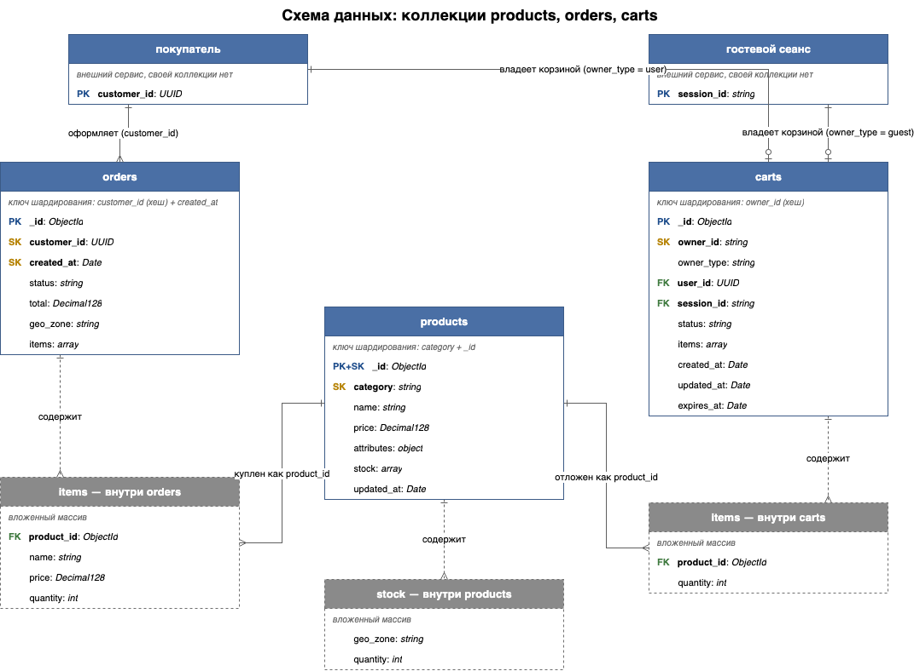

# Архитектурный документ

## Задание 7. Схемы коллекций и выбор ключей шардирования



### `products`

| Поле | Тип |
| --- | --- |
| `_id` | ObjectId |
| `name` | String |
| `category` | String |
| `price` | Decimal128 |
| `attributes` | Object |
| `stock` | Array `{ geo_zone, quantity }` |
| `updated_at` | Date |

Операции: обновление остатков, поиск по категории и цене, карточка товара.

| Кандидат | Почему нет / да |
| --- | --- |
| `{ category: 1 }` | Мало значений, «Электроника» (70 %) ляжет на один шард |
| `{ category: "hashed" }` | Вся категория = один хеш, дробить нельзя |
| `{ _id: "hashed" }` | Данные лягут ровно, но поиск по категории уйдёт на все шарды |
| `{ category: 1, _id: 1 }` | **Выбор.** По `category` — на нужные шарды; `_id` дробит «Электронику», чтобы не лежала одним куском |

Цену в ключ не беру: она меняется. Фильтр по цене — индекс `{ category: 1, price: 1 }`. В запросах по `_id` передавать `category`.

```javascript
sh.enableSharding("shop");
db.products.createIndex({ category: 1, _id: 1 });
sh.shardCollection("shop.products", { category: 1, _id: 1 });
db.products.createIndex({ category: 1, price: 1 });

db.products.find({ category: "audio", price: { $gte: 3000, $lte: 10000 } });
db.products.updateOne(
  {
    category: "electronics",
    _id: ObjectId("665f0c1a9b1e4d2f8c3a7e01"),
    stock: { $elemMatch: { geo_zone: "ekaterinburg", quantity: { $gte: 1 } } }
  },
  { $inc: { "stock.$.quantity": -1 }, $currentDate: { updated_at: true } }
);
```

### `orders`

| Поле | Тип |
| --- | --- |
| `_id` | ObjectId |
| `customer_id` | UUID |
| `created_at` | Date |
| `items` | Array (цены на момент покупки) |
| `status` | String |
| `total` | Decimal128 |
| `geo_zone` | String |

Операции: создание заказа, история покупателя, статус заказа.

| Кандидат | Почему нет / да |
| --- | --- |
| `{ created_at: 1 }` | Все новые заказы идут в крайний диапазон → один шард на запись в распродажу |
| `{ geo_zone: 1, created_at: 1 }` | Регионов мало, Москва перевесит; внутри региона снова растущий край |
| `{ _id: "hashed" }` | Пишется ровно, но историю покупателя придётся собирать со всех шардов |
| `{ customer_id: "hashed" }` | Ровная запись и история с одного шарда; нет порядка по дате (запасной вариант для MongoDB ниже 4.4) |
| `{ customer_id: "hashed", created_at: 1 }` | **Выбор.** Хеш раскидывает покупателей; история — один шард; `created_at` даёт «последние N» без сортировки в памяти |

```javascript
db.orders.createIndex({ customer_id: "hashed", created_at: 1 });
sh.shardCollection("shop.orders", { customer_id: "hashed", created_at: 1 });

db.orders.find({ customer_id: UUID("...") }).sort({ created_at: -1 }).limit(20);
```

### `carts`

| Поле | Тип |
| --- | --- |
| `_id` | ObjectId |
| `owner_id` | String (`session_id` или `user_id`) |
| `owner_type` | String (`guest` / `user`) |
| `user_id` | UUID / null |
| `session_id` | String / null |
| `items` | Array `{ product_id, quantity }` |
| `status` | String |
| `created_at`, `updated_at` | Date |
| `expires_at` | Date (автоочистка) |

Два пути поиска (`session_id` / `user_id`) сведены в `owner_id`, иначе половина запросов уйдёт на все шарды.

| Кандидат | Почему нет / да |
| --- | --- |
| `{ _id: "hashed" }` | Оба поиска уйдут на все шарды |
| `{ user_id: "hashed" }` | У гостей поля нет → все свалятся в `null` |
| `{ session_id: 1 }` | Для вошедших — на все шарды; значения идут подряд и дают растущий край |
| `{ owner_id: "hashed" }` | **Выбор.** Оба пути — на один шард |

Слияние при входе — два шарда (разные `owner_id`); без транзакции между шардами.

```javascript
db.carts.createIndex({ owner_id: "hashed" });
sh.shardCollection("shop.carts", { owner_id: "hashed" });
db.carts.createIndex({ owner_id: 1, status: 1 });
db.carts.createIndex({ expires_at: 1 }, { expireAfterSeconds: 0 });

db.carts.findOne({ owner_id: "sess_...", status: "active" });
```

### Сводка

| Коллекция | Ключ | Стратегия |
| --- | --- | --- |
| `products` | `{ category: 1, _id: 1 }` | по диапазонам |
| `orders` | `{ customer_id: "hashed", created_at: 1 }` | по хешу |
| `carts` | `{ owner_id: "hashed" }` | по хешу |

---

## Задание 8. Горячие шарды

Контекст: 70 % запросов на «Электронику» выходит перегруз одного шарда. Балансировщик выравнивает данные, не нагрузку.

### Метрики

| Метрика | Источник | Порог |
| --- | --- | --- |
| Операции в секунду по шардам | `opcounters`, `mongostat` | > 40 % на один шард при равном объёме, 10 мин |
| Доля запросов на все шарды | `shardingStatistics`, `explain` | > 10 % |
| Задержка ответа (99-й процентиль) по шардам | `mongotop`, Prometheus | в 2 раза выше среднего |
| Объём / число чанков | `sh.status()`, `getShardDistribution()` | разница > 20 % |
| Очередь | `globalLock.currentQueue` | стабильно > 0 |
| Процессор / диск | мониторинг хостов | > 70 %, 15 мин |
| Попадания в кеш WiredTiger | `wiredTiger.cache` | < 90 % |
| Отставание вторичных | `rs.printSecondaryReplicationInfo()` | > 10 с |
| Неделимые чанки (`jumbo`) | `sh.status()` | любой |
| Доля запросов по значению ключа | метрики приложения | > 30 % на одно значение |

```javascript
db.products.getShardDistribution();
sh.status();
db.products.find({ category: "electronics" }).explain("executionStats").shards;
```

### Механизмы перераспределения

1. **Зоны** — «Электронику» на выделенные шарды:

```javascript
sh.addShardToZone("shard1", "hot");
sh.addShardToZone("shard2", "hot");
sh.updateZoneKeyRange(
  "shop.products",
  { category: "electronics", _id: MinKey },
  { category: "electronics", _id: MaxKey },
  "hot"
);
```

2. **Разрезать и перенести чанки** (`split` / `moveChunk`) — быстрый ручной разнос:

```javascript
sh.splitFind("shop.products", { category: "electronics" });
sh.moveChunk("shop.products", { category: "electronics", _id: ObjectId("...") }, "shard3");
```

3. **`refineCollectionShardKey`** — дописать поле к существующему ключу (без полной перекладки).

4. **`reshardCollection`** — смена ключа (в спокойное время, MongoDB ≥ 5.0).

5. **Окно балансировщика** и размер чанка:

```javascript
use config;
db.settings.updateOne(
  { _id: "balancer" },
  { $set: { activeWindow: { start: "01:00", stop: "06:00" } } },
  { upsert: true }
);
```

6. **Кеш (Redis) + чтение со вторичных** — снять чтения с горячего шарда без смены раскладки.

Для ключа `{ category: 1, _id: 1 }` «Электроника» уже дробится по `_id`. Зоны — если нагрузка всё ещё сидит на отдельных узлах.

---

## Задание 9. Чтение с реплик

| Коллекция | Операция | Откуда читать | Допустимое отставание | Почему |
| --- | --- | --- | --- | --- |
| `products` | Подбор / карточка | `secondaryPreferred` | 10 с | Редко меняется |
| `products` | Остаток в карточке | `secondaryPreferred` | 5 с | Справочно |
| `products` | Проверка остатка при оформлении | `primary` + `majority` | 0 | Иначе можно продать то, чего нет |
| `orders` | Статус сразу после оплаты | `primary` | 0 | Человек должен увидеть свою же запись |
| `orders` | Статус позже | `primaryPreferred` | 5 с | Доступность |
| `orders` | История | `secondaryPreferred` | 10 с | Старые заказы уже не меняются |
| `orders` | Отчёты | `secondary` | 5 мин | Не грузить первичный |
| `carts` | Активная корзина / слияние | `primary` | 0 | Сразу после записи |
| `carts` | Брошенные корзины для аналитики | `secondary` | 5 мин | Фоновая задача |

Запись всегда на первичный узел (`w=majority` для заказов и остатков).

Пороги 5–10 с держим мониторингом отставания (`rs.printSecondaryReplicationInfo()`): `maxStalenessSeconds` меньше 90 секунд MongoDB не принимает.

```
mongodb://mongos_router:27020/shop?readPreference=secondaryPreferred&maxStalenessSeconds=90&w=majority
```

---

## Задание 10. Cassandra

### 10.1. Что куда

| Данные | Куда | Почему |
| --- | --- | --- |
| История заказов, статусы | Cassandra | В основном только добавляем, читаем по id, объём растёт |
| Корзины, сессии, просмотры | Cassandra | Большой поток записи, автоочистка по сроку, потеря одной записи не критична |
| Остатки, каталог, оформление заказа | MongoDB | Нужны проверка и изменение одной операцией / произвольные фильтры / транзакции |

### 10.2. Модель

```sql
CREATE KEYSPACE shop WITH replication = {
  'class': 'NetworkTopologyStrategy', 'dc_msk': 3, 'dc_ekb': 3
};

CREATE TABLE shop.orders_by_customer (
    customer_id uuid, period text, created_at timestamp, order_id uuid,
    status text, total decimal, geo_zone text,
    items list<frozen<order_item>>,
    PRIMARY KEY ((customer_id, period), created_at, order_id)
) WITH CLUSTERING ORDER BY (created_at DESC, order_id ASC);

CREATE TABLE shop.orders_by_id (
    order_id uuid PRIMARY KEY,
    customer_id uuid, created_at timestamp, status text,
    total decimal, geo_zone text, items list<frozen<order_item>>
);

CREATE TABLE shop.order_status_history (
    order_id uuid, changed_at timestamp, status text, comment text,
    PRIMARY KEY ((order_id), changed_at)
) WITH CLUSTERING ORDER BY (changed_at DESC);

CREATE TABLE shop.carts_by_owner (
    owner_id text, owner_type text, status text,
    items list<frozen<order_item>>,
    created_at timestamp, updated_at timestamp,
    PRIMARY KEY ((owner_id))
) WITH default_time_to_live = 604800;
```

| Таблица | Ключ раздела | Порядок внутри | Защита от горячей партиции |
| --- | --- | --- | --- |
| `orders_by_customer` | `(customer_id, period)` | `created_at` по убыванию | месяц режет длинную историю; покупателей много |
| `orders_by_id` | `order_id` | — | уникальные id |
| `order_status_history` | `order_id` | `changed_at` по убыванию | маленькие партиции |
| `carts_by_owner` | `owner_id` | — | одна корзина на партицию |

Не брать категорию или геозону ключом раздела — получится та же «Электроника» на одних узлах. Мелкие партиции → добавление узлов без полной перекладки (в отличие от range-шардирования в MongoDB).

### 10.3. Восстановление целостности

| Сущность | Основное | Дополнительно | Согласованность | Почему |
| --- | --- | --- | --- | --- |
| Заказы | Плановая сверка раз в неделю | подсказки + починка при чтении | запись и чтение `LOCAL_QUORUM` | Деньги |
| Статусы | Плановая сверка раз в неделю | подсказки | запись `LOCAL_QUORUM`, чтение `LOCAL_ONE` | Писать надёжно, читать можно чуть устаревшее |
| Корзины | Плановая сверка раз в 3–5 дней | подсказки + починка при чтении | запись и чтение `LOCAL_QUORUM` | Сразу после изменения читаем своё; из‑за срока жизни — сверка чаще |
| Сессии / просмотры | Подсказки при недоступности | починка при чтении изредка | `LOCAL_ONE` | Важнее скорость, чем идеальная сходимость |

```shell
nodetool repair -pr -local shop
```
